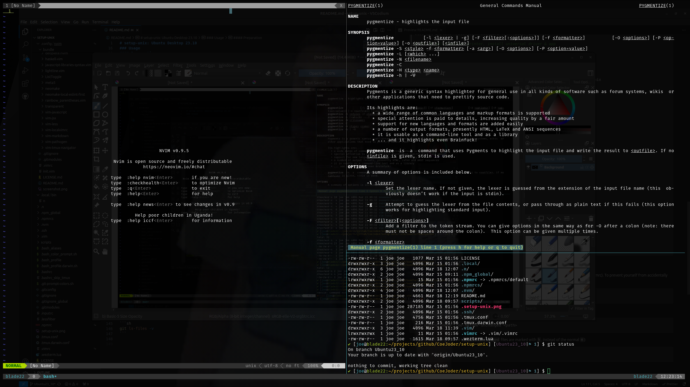

# setup-unix: Linux Mint 22.1
My setup on Linux Mint 22.1

## Preview



The terminal emulator is [WezTerm](https://wezfurlong.org/wezterm/index.html).

The font is [Fira Mono NerdFont](https://github.com/mozilla/Fira) which is already patched with powerline symbols.

The programs being run are [tmux](https://github.com/tmux/tmux) for multiplexing
the various shells, [neovim](https://github.com/neovim/neovim) for editing, and
bash for the shell, all set up using the configurations in this repo.

## Pre-setup

If moving from a previous O/S instance:
- ensure that a BackInTime `/home` snapshot is available
- export browser bookmarks for each profile

## Setup

```bash
# update/upgrade
sudo apt update -y && sudo apt upgrade -y

# install APT packages
sudo apt install -y tmux pipx python3-pynvim gawk git firetools shfmt backintime-qt chromium ripgrep jq
# (no need to run `pipx ensurepath`, it's already set in ~/.profile)

# Calender
#   Set custom format
#   - Date format: %A, %b %-d, %-I:%M %p
#   - Date format for tooltip: %A, %b %-d, %-I:%M %p

# Screensaver
#   Set custom format
#   - Time Format: %-I:%M %p
#   - Date Format: %A, %b %-d

# Clock
#   Add desklet and set custom format
#   - Date format: %A, %b %-d, %-I:%M %p

# Files (Edit > Preferences > Views)
#   Set default view
#   - View new folders using: "List View"
#   - enable "Inherit view type from parent"

# Keyboard (Shortcuts)
#   Add shortcut bindings
#   - Minimize window: ❖ + M
#   Remove shortcut bindings
#   - Move window to workspace above
#   - Move window to workspace below

# Keyboard (Layouts > Options... > Position of Compose key)
#   Set compose key
#   - [x] Pause

# Mouse and Touchpad (Mouse > General)
#   Configure settings
#   - disable "Paste the current selection when middle-click is pressed"

# install Brave
# see: https://brave.com/linux/
sudo curl -fsSLo /usr/share/keyrings/brave-browser-archive-keyring.gpg https://brave-browser-apt-release.s3.brave.com/brave-browser-archive-keyring.gpg
echo "deb [signed-by=/usr/share/keyrings/brave-browser-archive-keyring.gpg] https://brave-browser-apt-release.s3.brave.com/ stable main"|sudo tee /etc/apt/sources.list.d/brave-browser-release.list
sudo apt update
sudo apt install brave-browser
# set Brave as the default browser in "Preferred Applications"
# pin Brave to Panel
# import browser profiles

# configure Brave settings: `brave://settings`
# - On Startup: Open the New Tab page
# - disable "Media Router"
# - disable "WebTorrent"
# - enable "Widevine"

# configure Brave flags: `brave://flags/`
# - middle-button-autoscroll

# configure Brave shortcuts: `brave://settings/system/shortcuts`
# - Move tab to new window: ctrl + shift + space

# launch Firefox Profile Manager
firefox -P
# for each profile to restore:
# - create a new profile
# - restore profile data from backup: https://support.mozilla.org/en-US/kb/recovering-important-data-from-an-old-profile#w_bookmarks-downloads-and-browsing-history
# - import bookmarks

# configure Firefox settings: ☰ > Settings > Find in Settings
# - enable "Use auto-scrolling"
# - enable "Play DRM-controlled content"
# - enable "Tell websites not to sell or share my data"
# - enable "Send websites a “Do Not Track” request"
# - disable "Show trending search suggestions"
# - disable "Suggestions from Firefox"
# - disable "Suggestions from sponsors"
# - disable "Suggest strong passwords"
# - disable "Suggest Firefox Relay email masks to protect your email address"
# - disable "Save and fill payment methods"
# - disable "Allow Firefox to send technical and interaction data to Mozilla"
# - disable "Allow websites to perform privacy-preserving ad measurement"
# - disable "Block dangerous and deceptive content"

# configure Firefox advanced preferences: `about:config`
# - full-screen-api.warning.timeout = 0
# - middlemouse.paste = false

# install vendor-specific drivers
# e.g. for a Razer Blade, install OpenRazer packages:
# see: https://openrazer.github.io/#ubuntu
sudo apt install -y software-properties-gtk
sudo add-apt-repository -y ppa:openrazer/stable
sudo apt update -y && sudo apt install --install-suggests -y openrazer-meta

# install Neovim and set as default terminal editor
sudo add-apt-repository -y ppa:neovim-ppa/stable
sudo apt update -y && sudo apt install -y neovim
sudo update-alternatives --install /usr/bin/vi vi /usr/bin/nvim 60
sudo update-alternatives --install /usr/bin/vim vim /usr/bin/nvim 60
sudo update-alternatives --install /usr/bin/editor editor /usr/bin/nvim 60

# install more APT packages (required by pyenv)
sudo apt install -y build-essential libssl-dev zlib1g-dev \
libbz2-dev libreadline-dev libsqlite3-dev curl git \
libncursesw5-dev xz-utils tk-dev libxml2-dev libxmlsec1-dev libffi-dev liblzma-dev
# install pyenv
curl -fsSL https://pyenv.run | bash

# install ytp-dlp, Pygments, Pipenv, ruff, wtfis
pipx install yt-dlp[default]
pipx install Pygments
pipx install pipenv --user
pipx install ruff
pipx install wtfis

# install Flathub, Emote, Krita, KeePassXC
flatpak install --system flathub
flatpak install --system com.tomjwatson.Emote
flatpak install --system org.kde.krita
flatpak install --system org.keepassxc.KeePassXC
# restore KeePassXC db from backup: ~/.keepassxc

# install FiraMonoNerdFont
wget https://github.com/ryanoasis/nerd-fonts/releases/download/v3.3.0/FiraMono.zip -P ~/Downloads
mkdir -p ~/.fonts
unzip ~/Downloads/FiraMono.zip -d ~/.fonts/FiraMonoNerdFont
fc-cache -fv

# verify FiraMonoNerdFont installation
fc-list | grep "FiraMono Nerd Font Mono"

# install WezTerm
curl -fsSL https://apt.fury.io/wez/gpg.key | sudo gpg --yes --dearmor -o /usr/share/keyrings/wezterm-fury.gpg
echo 'deb [signed-by=/usr/share/keyrings/wezterm-fury.gpg] https://apt.fury.io/wez/ * *' | sudo tee /etc/apt/sources.list.d/wezterm.list
sudo apt update -y && sudo apt install -y wezterm
# set WezTerm as the terminal in "Preferred Applications"

# install VSCodium
# see: https://vscodium.com/#use-a-package-manager-deb-rpm-provided-by-vscodium-related-repos
# restore VSCodium extensions from backup: ~/.vscode-oss/extensions

# install BeyondCompare
wget https://www.scootersoftware.com/files/bcompare-5.0.5.30614_amd64.deb -P ~/Downloads
sudo apt update -y && sudo apt install -y ~/Downloads/bcompare-5.0.5.30614_amd64.deb
# import BeyondCompare license key: Help > Enter key…

# install Joplin
wget -O - https://raw.githubusercontent.com/laurent22/joplin/dev/Joplin_install_and_update.sh | bash
# restore Joplin data from backup: ~/.config/joplin-desktop

# set static IP for printer and test using driverless printing/scanning
# see: https://forums.linuxmint.com/viewtopic.php?p=1663963#p1663963
sudo gpasswd -a $USER lp
sudo gpasswd -a $USER lpadmin

# create SSH client directories
mkdir -p ~/.ssh/sockets
# restore SSH keys from backup: ~/.ssh

# setup dotfiles
# IMPORTANT: set GITHUB_USER to your main GitHub username
GITHUB_USER=CoeJoder
SETUP_UNIX_DIR="$HOME/projects/github/$GITHUB_USER/setup-unix"
mkdir -p $SETUP_UNIX_DIR
git clone https://github.com/CoeJoder/setup-unix.git $SETUP_UNIX_DIR
pushd $SETUP_UNIX_DIR
git branch -a
git checkout Mint22_1

# restore private git configs from backup: ~/.config/git
# deploy git configs, switch to git+ssh, deploy the rest
./scripts/deploy_setup_unix.sh --bootstrap
git remote set-url origin "github.com_$GITHUB_USER:CoeJoder/setup-unix.git"
git submodule update --init --recursive
./scripts/deploy_setup_unix.sh --all
popd

# setup Joplin sandboxing
sed -i 's|Exec=.*|Exec=/bin/bash -c "firejail --appimage --profile=joplin --nosound "$HOME/.joplin/Joplin.AppImage""|g' ~/.local/share/applications/appimagekit-joplin.desktop
update-desktop-database
# start Joplin and set the backup directory to: ~/.config/joplin-desktop/JoplinBackup
# before quitting Joplin, verify that it is listed here:
# firejail --list

# enable autoscroll on Chromium
sudo sed -ri 's|Exec=(.*)|Exec=\1 --enable-blink-features=MiddleClickAutoscroll|g' /usr/share/applications/chromium-browser.desktop
update-desktop-database

# setup NodeJS
n lts
npm_g install

# setup neovim plugins
nvim
:UpdateRemotePlugins
:TransparentEnable
# the previous command may give innocuous error message;
# restart neovim to see if transparency is working

# reboot
sudo reboot
```

## Post-setup

- verify the above settings are applied
- enable Gufw ("Firewall Configuration" app)
  - default "Home" profile
- setup Timeshift snapshots
  - default includes/excludes
  - Monthly: 1, Weekly: 1, Daily: 7
- setup BackInTime snapshots
  - include: /home/[user]
  - default excludes
  - Custom hours: 12,22
- schedule periodic Foxclone full-disk backups
- test restoration of Timeshift/BackInTime snapshots in a Mint VM
- test restoration of Foxclone backup via file-to-drive clone in a VM

## Using git+ssh
- to work as multiple users per host across projects, git-ssh is configured based on the project directory.  See:
  - ~/.ssh/config
  - ~/.config/git/config
- projects should be cloned using `gitssh_clone()`, e.g:
    - `gitssh_clone git@github.com:torvalds/linux.git`

### IMPORTANT
Ensure git and ssh configs are correct at this point.
