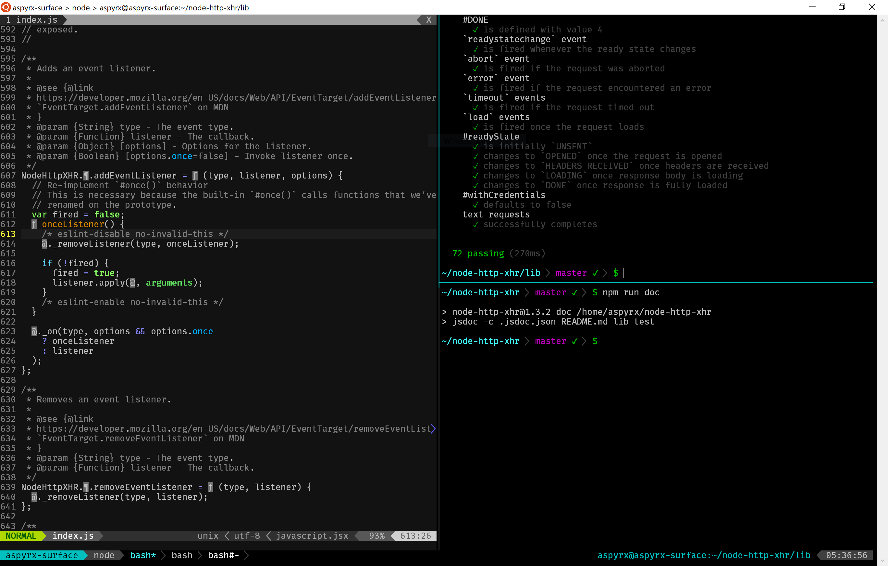

# setup-unix
My standard setup on UNIX-like systems.

### Preview



The terminal emulator is [WSLtty](https://github.com/mintty/wsltty), running on
Windows 10, using the Windows Subsystem for Linux + Ubuntu 16.04.2 LTS.

The font is [Fira Code](https://github.com/tonsky/FiraCode), which has neat
programming ligatures and is already patched with powerline symbols.

The programs being run are [tmux](https://github.com/tmux/tmux) for multiplexing
the various shells, [neovim](https://github.com/neovim/neovim) for editing, and
bash for the shell, all set up using the configurations in this repo.

### Usage

####  macOS-specific instructions

1. Skip this section if you are not running macOS.
2. Install [MacPorts](https://www.macports.org/install.php). Other macOS
   package managers work too, but I use MacPorts.
3. Install the `coreutils`, `tmux`, and `tmux-pasteboard` ports:
   `sudo port install coreutils tmux tmux-pasteboard`

#### Preparation

1. Install [Neovim](https://github.com/neovim/neovim/wiki/Installing-Neovim).
2. Install [Python 3](https://www.python.org/downloads/).
    - Your package manager may have a relevant package.
3. Install the `neovim` pip package: `pip3 install neovim`.

#### Installation

1. Clone the repo and move the files into your home directory:
    - `rsync -avh ~/setup-unix/ ~`
        - Thanks to [@mark-walle](https://github.com/mark-walle) for this trick
          from [issue #1](https://github.com/aspyrx/setup-unix/issues/1).
    - This *WILL* overwrite existing files; please make a backup if you care
      about your existing config!
2. **IMPORTANT** Modify all the following files with your own name/email:
    - In `.gitconfig`:
        - `name` and `email` should have your own name and email.
3. Get the submodules (this may take a while):
   `git submodule update --init --recursive`
4. Restart your shell.

That's it!

#### Optional: Installing `node.js` dependencies

5. Install the desired version of `node.js`: `n <node version>`
6. Update npm: `npm install -g npm`
7. Install "global" npm modules: `npm_g install`
    - See [.npm_global](https://github.com/aspyrx/.npm_global) for more details
8. Restart your shell.

### Notes

Some personal configuration/state is often contained in these configuration
files (e.g. npm logins stored in .npmrc). To prevent yourself from accidentally
adding these to the repo, try:

```sh
git update-index --assume-unchanged <path>
```

To start automatically checking for changes again:

```sh
git update-index --no-assume-unchanged <path>
```

To show all files being tracked (`assume-unchanged` files are marked with `h`,
instead of the normal `H`):

```sh
git ls-files -v
```

